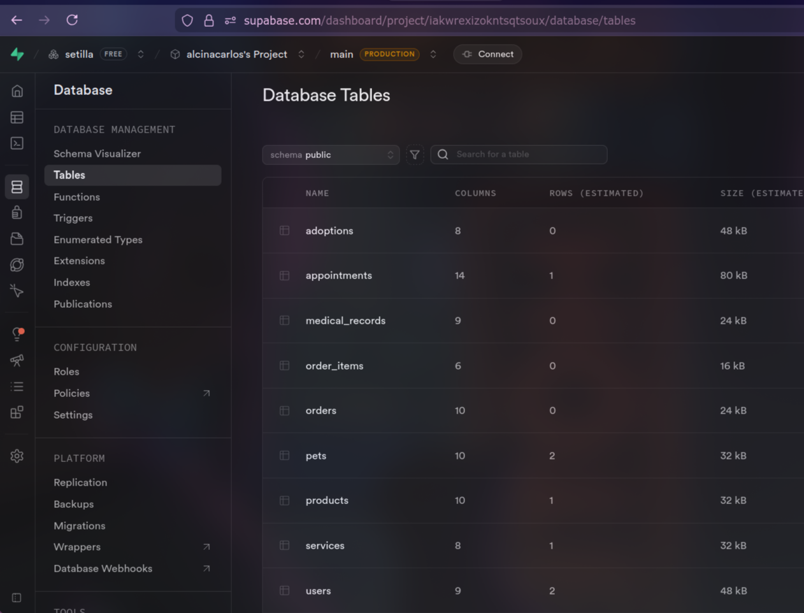
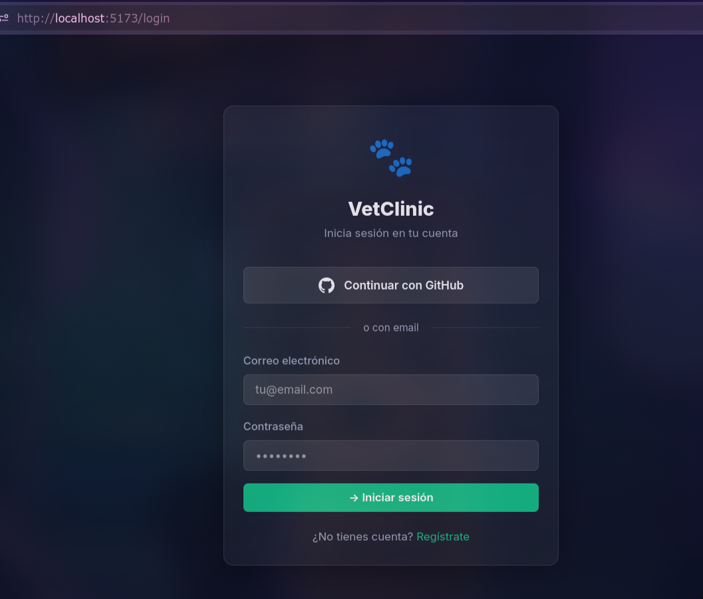
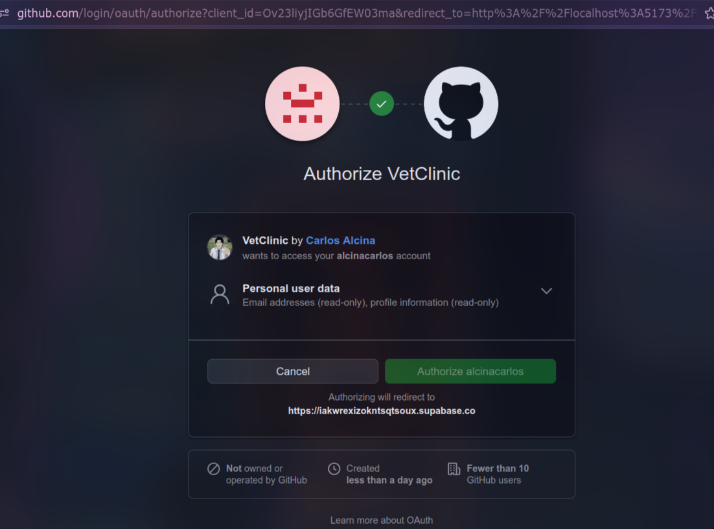
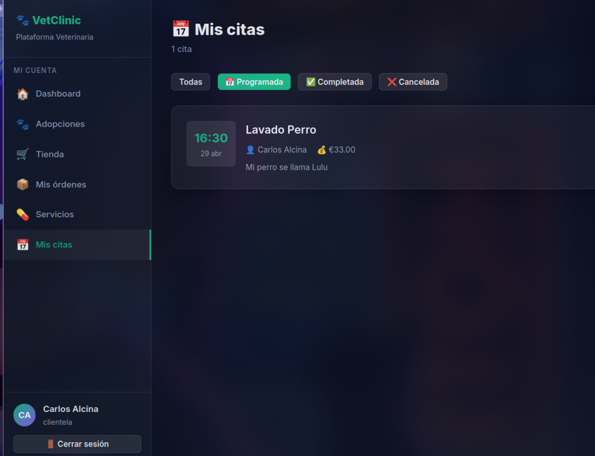
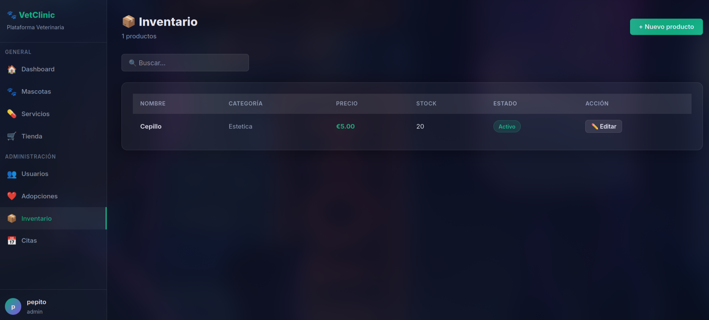
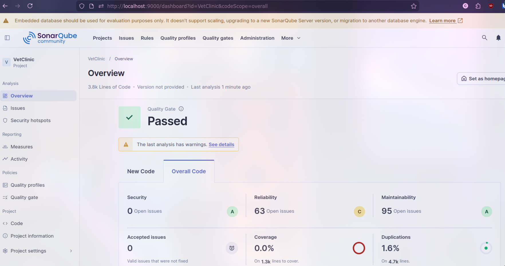
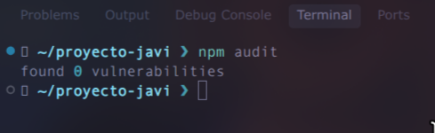
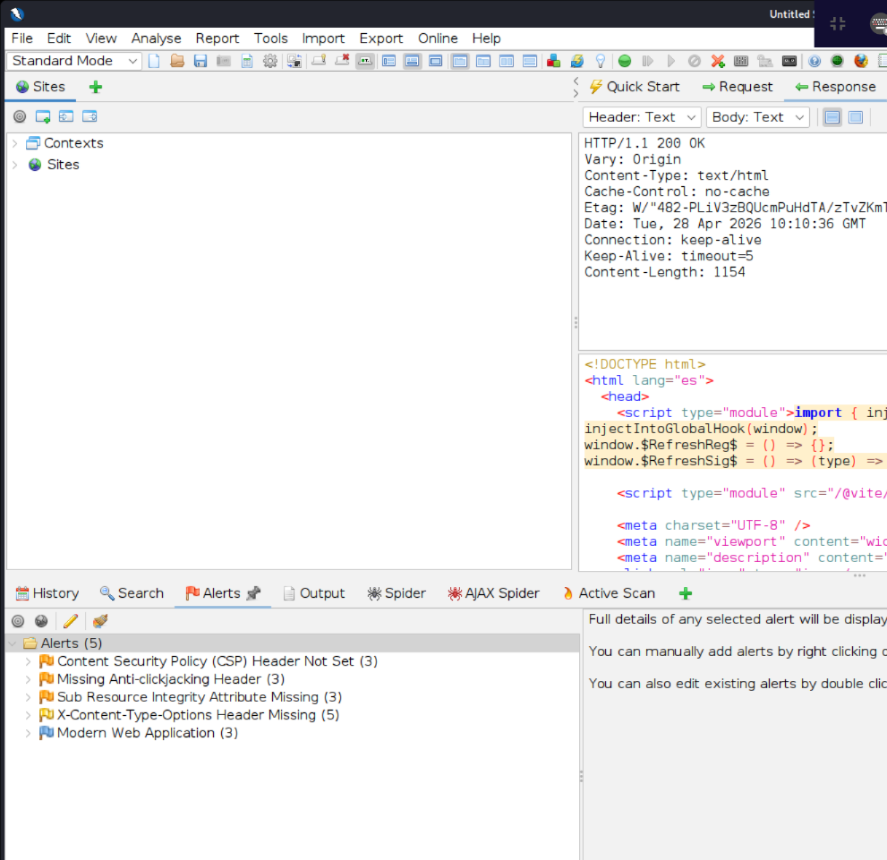

# Clínica Veterinaria

Este repositorio contiene la documentación y el código de una **aplicación web para una Clínica Veterinaria**. El sistema integra venta de artículos, adopción de mascotas y reserva de servicios veterinarios, aplicando rigurosamente prácticas de desarrollo seguro (DevSecOps) y arquitecturas modernas basadas en frameworks.

## Descripción del Proyecto

La plataforma permite gestionar de forma integral una clínica veterinaria con los siguientes módulos principales:
- **Venta de artículos:** Tienda online de productos para mascotas.
- **Adopción de mascotas:** Plataforma para visualizar y tramitar adopciones.
- **Servicios Veterinarios:** Gestión de citas y servicios clínicos.
- **Sistema de Ofertas:** Lógica de negocio que aplica ofertas exclusivas en la tienda (artículos y servicios) para aquellos clientes que hayan adoptado mascotas a través de la plataforma.

### Roles del Sistema (RBAC)
- **Admin:** Control total sobre la plataforma, usuarios y configuración.
- **Clientela:** Acceso a la tienda, adopciones, servicios y visualización de sus propios datos.
- **Veterinari@s:** Gestión de citas, historiales médicos y servicios clínicos.
- **Ventas:** Gestión exclusiva del inventario de la tienda, artículos y pedidos.

---

## Cumplimiento de Requisitos y Seguridad (DevSecOps)

El desarrollo se ha enfocado primordialmente en la integración de herramientas de seguridad y en el control de acceso estricto, cumpliendo con las siguientes condiciones:

### 1. Despliegue en Render y Supabase
La aplicación utiliza una arquitectura moderna donde el backend se despliega en **Render.com** (usando herramientas de gestión de secretos nativas para las variables de entorno) y la base de datos es administrada mediante **Supabase** (PostgreSQL).

### 2. Autenticación OAuth 2
Se ha delegado la autenticación a un proveedor de identidad moderno mediante el protocolo **OAuth 2**, garantizando un inicio de sesión seguro, sin necesidad de almacenar contraseñas localmente, y facilitando el acceso a los usuarios.

### 3. Gestión de Autorización (RBAC y ABAC)
La plataforma implementa un robusto control de acceso:
- **RBAC (Role-Based Access Control):** Limita la visibilidad y las acciones de los usuarios en función de su rol (Admin, Clientela, Veterinari@, Ventas).
- **ABAC (Attribute-Based Access Control):** Añade una capa extra de seguridad validando atributos dinámicos (por ejemplo, asegurando que un cliente solo pueda ver sus propias facturas o que las ofertas exclusivas solo se apliquen si el atributo "ha_adoptado" es verdadero).

### 4. Herramientas de SAST (Análisis Estático)
Se ha integrado **SonarQube** en el ciclo de desarrollo para analizar el código fuente en busca de *code smells*, vulnerabilidades y bugs de seguridad antes de que el código llegue a producción.

### 5. Análisis RCA / Dependencias (SCA)
Para evitar la introducción de vulnerabilidades a través de librerías de terceros (ataques a la cadena de suministro), se ha utilizado herramientas de análisis de dependencias (OWASP Dependency Check / `npm audit`).

### 6. Análisis DAST (OWASP ZAP)
#### [Reporte ZAP](ZAP-RzEPORT.html)

Como última barrera de defensa, se ha sometido la aplicación web en ejecución a un Análisis Dinámico de Seguridad (DAST) utilizando **OWASP ZAP** (Zed Attack Proxy), interceptando peticiones e inyectando *payloads* para comprobar la resistencia ante ataques reales (ej. XSS, Inyección SQL, configuraciones misceláneas).

---

## Despliegue y Ejecución
### Link de la aplicación: [Render](https://clinica-veterinaria-s0s4.onrender.com)
* **Backend:** Ejecuta con Node.js usando un framework fijo (Express/Nest). Las variables críticas están protegidas mediante gestión de secretos (archivos `.env` en local, Secret Management en Render para producción).
* **Frontend:** Framework reactivo conectado vía API REST al backend.
